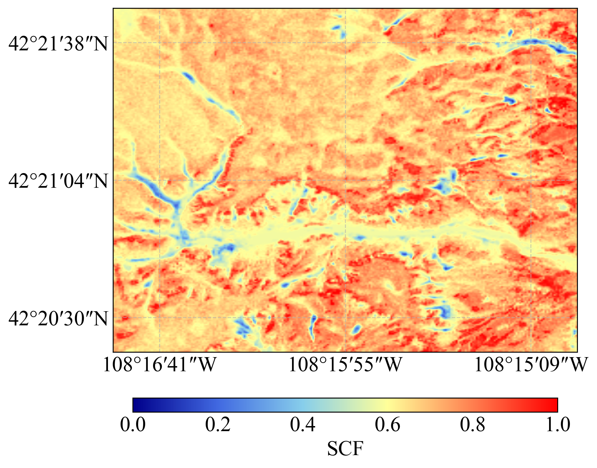

# Landscape preconditioning enables high-resolution prediction of snow cover fraction

*Deep learning framework for snow cover fraction prediction using DeepLabV3+*

[](https://opensource.org/licenses/MIT)
[](https://www.python.org/downloads/release/python-390/)
[](https://pytorch.org/)

---

## Snow Prediction Example



This project implements a deep learning framework for predicting snow cover fraction (SCF) using the DeepLabV3+ architecture with a ResNet‑50 backbone. The model integrates multi‑source spatial features (terrain, meteorology, and NDVI) to generate high‑resolution SCF maps.

---

## Main Features

- Multi‑channel input: elevation, slope, NDVI, temperature, precipitation, wind speed, wind direction, and humidity.
- Regression‑based DeepLabV3+ with a ResNet‑50 encoder.
- Physical constraint loss to enforce realistic snow distribution patterns.
- End‑to‑end training and inference pipeline with visualization tools.

---

## Data Availability

All datasets used in this study are publicly available:

- **ERA5 hourly reanalysis** – obtained from the European Centre for Medium‑Range Weather Forecasts (ECMWF) via the Copernicus Climate Data Store (CDS):  
  [https://cds.climate.copernicus.eu/datasets/reanalysis-era5-single-levels](https://cds.climate.copernicus.eu/datasets/reanalysis-era5-single-levels)
- **Sentinel‑2 imagery** – accessed through the Copernicus Data Space Ecosystem:  
  [https://dataspace.copernicus.eu/](https://dataspace.copernicus.eu/)
- **10 m DEM for the contiguous United States** – from the U.S. Geological Survey (USGS) 3DEP via OpenTopography:  
  [https://portal.opentopography.org/](https://portal.opentopography.org/)
- **DEM for China and Europe** – derived from Copernicus DEM (primary) with missing areas supplemented by NASADEM (available via NASA Earthdata):  
  [https://dataspace.copernicus.eu/explore-data/data-collections/copernicus-contributing-missions/collections-description/COP-DEM](https://dataspace.copernicus.eu/explore-data/data-collections/copernicus-contributing-missions/collections-description/COP-DEM)  
  [https://earthdata.nasa.gov/](https://earthdata.nasa.gov/)

The processed datasets generated in this study are available from the corresponding author upon reasonable request.

---

## Code Availability

The complete source code for training, validation, testing, and inference is publicly available at:  
[https://github.com/hanmouwang7-debug/SCF](https://github.com/hanmouwang7-debug/SCF)

This repository facilitates reproduction and further development of the methodology presented in this study.

---

## System Requirements

- **Operating System**: Windows 10/11, Linux, or macOS
- **GPU**: NVIDIA GPU with at least 24 GB memory (recommended)
- **Software**: Python 3.9, PyTorch 2.0.0, CUDA 11.8 (if using GPU)

---

## Training Configuration

All experiments were performed on the **Alibaba Cloud Elastic GPU** platform ([Alibaba Cloud Elastic GPU Service](https://www.aliyun.com/product/egs)) using **NVIDIA A10** GPUs (24 GB memory). The software environment was Python 3.9, PyTorch 2.0.0, and CUDA 11.8.

**Optimization settings:**
- **Optimizer**: AdamW
- **Backbone (ResNet‑50) learning rate**: 5×10⁻⁵
- **ASPP / decoder / regression head learning rate**: 1×10⁻⁴
- **Weight decay**: 1×10⁻⁵
- **Batch size**: 8
- **Maximum epochs**: 200
- **Gradient clipping**: max norm 1.0
- **Early stopping**: based on validation MAE, patience = 15 epochs (best model retained)

**Data augmentation (training only):**
- Random horizontal and vertical flipping
- 90° rotations (applied synchronously to inputs and labels)
- No augmentation during validation or testing (except normalization)

All experiments followed identical protocols to ensure fair comparison and reproducibility.

---

## Usage

### Training
```bash
python train.py --config configs/config.yaml
```
- See [`train.py`](train.py) for detailed training logic.
- Training configuration is defined in [`configs/config.yaml`](configs/config.yaml).

### Validation
```bash
python validate.py --checkpoint outputs/checkpoints/deeplab_best_mae.pth
```
- Use [`validate.py`](validate.py) to evaluate on the validation set.
  
### Testing
```bash
python test.py --checkpoint outputs/checkpoints/deeplab_best_mae.pth
```
- Run [`test.py`](test.py) to obtain final test set results.
